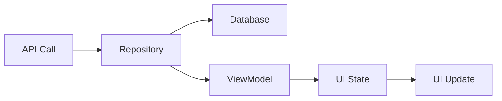

# Ayoba Images - Implementation Details

## Table of Contents
1. [Setup and Configuration](#setup-and-configuration)
2. [Data Flow](#data-flow)
3. [UI Implementation](#ui-implementation)
4. [Error Handling](#error-handling)
5. [Performance Optimization](#performance-optimization)
6. [Testing Implementation](#testing-implementation)

## Setup and Configuration

### Project Setup
```gradle
// build.gradle (app)
plugins {
    id 'com.android.application'
    id 'kotlin-android'
    id 'kotlin-kapt'
    id 'dagger.hilt.android.plugin'
}

dependencies {
    // Core Android
    implementation 'androidx.core:core-ktx:1.12.0'
    implementation 'androidx.appcompat:appcompat:1.6.1'
    implementation 'com.google.android.material:material:1.11.0'
    
    // Architecture Components
    implementation 'androidx.lifecycle:lifecycle-viewmodel-ktx:2.7.0'
    implementation 'androidx.lifecycle:lifecycle-runtime-ktx:2.7.0'
    
    // Dependency Injection
    implementation 'com.google.dagger:hilt-android:2.50'
    kapt 'com.google.dagger:hilt-compiler:2.50'
    
    // Networking
    implementation 'com.squareup.retrofit2:retrofit:2.9.0'
    implementation 'com.squareup.retrofit2:converter-gson:2.9.0'
    implementation 'com.squareup.okhttp3:logging-interceptor:4.12.0'
    
    // Database
    implementation 'androidx.room:room-runtime:2.6.1'
    implementation 'androidx.room:room-ktx:2.6.1'
    kapt 'androidx.room:room-compiler:2.6.1'
    
    // Image Loading
    implementation 'com.github.bumptech.glide:glide:4.16.0'
    kapt 'com.github.bumptech.glide:compiler:4.16.0'
}
```

### Application Configuration
```kotlin
@HiltAndroidApp
class AyobaImagesApplication : Application() {
    override fun onCreate() {
        super.onCreate()
        // Initialize any app-wide configurations
    }
}
```

## Data Flow

### API to UI Flow


### Data Transformation
```kotlin
// API Response to Database Entity
fun CatImageResponse.toEntity(page: Int, index: Int): CatImage {
    return CatImage(
        remoteId = id,
        imageUrl = url,
        title = "Cat Image ${(page * BATCH_SIZE) + index + 1}",
        description = "A beautiful cat image with dimensions ${width}x${height}"
    )
}

// Database Entity to UI Model
fun CatImage.toUiModel(): CatImageUiModel {
    return CatImageUiModel(
        id = remoteId,
        imageUrl = imageUrl,
        title = title,
        description = description
    )
}
```

## UI Implementation

### Layout Structure
```xml
<!-- activity_main.xml -->
<?xml version="1.0" encoding="utf-8"?>
<androidx.constraintlayout.widget.ConstraintLayout>
    <androidx.swiperefreshlayout.widget.SwipeRefreshLayout>
        <androidx.recyclerview.widget.RecyclerView />
    </androidx.swiperefreshlayout.widget.SwipeRefreshLayout>
    
    <ProgressBar />
    <LinearLayout android:id="@+id/errorView" />
    <LinearLayout android:id="@+id/emptyView" />
</androidx.constraintlayout.widget.ConstraintLayout>
```

### RecyclerView Item Layout
```xml
<!-- item_cat_image.xml -->
<?xml version="1.0" encoding="utf-8"?>
<com.google.android.material.card.MaterialCardView>
    <androidx.constraintlayout.widget.ConstraintLayout>
        <ImageView />
        <TextView android:id="@+id/titleText" />
        <TextView android:id="@+id/descriptionText" />
    </androidx.constraintlayout.widget.ConstraintLayout>
</com.google.android.material.card.MaterialCardView>
```

## Error Handling

### Network Error Handling
```kotlin
sealed class NetworkResult<out T> {
    data class Success<T>(val data: T) : NetworkResult<T>()
    data class Error(val exception: Exception) : NetworkResult<Nothing>()
    data object Loading : NetworkResult<Nothing>()
}

suspend fun <T> safeApiCall(
    apiCall: suspend () -> T
): NetworkResult<T> {
    return try {
        NetworkResult.Success(apiCall.invoke())
    } catch (throwable: Throwable) {
        when (throwable) {
            is IOException -> NetworkResult.Error(Exception("Network error"))
            is HttpException -> NetworkResult.Error(Exception("Server error"))
            else -> NetworkResult.Error(Exception("Unknown error"))
        }
    }
}
```

### Database Error Handling
```kotlin
suspend fun <T> safeDbCall(
    dbCall: suspend () -> T
): Result<T> {
    return try {
        Result.success(dbCall.invoke())
    } catch (e: SQLiteException) {
        Result.failure(Exception("Database error: ${e.message}"))
    }
}
```

## Performance Optimization

### Image Loading Optimization
```kotlin
object ImageLoadingConfig {
    fun configureGlide(context: Context) {
        Glide.with(context)
            .setDefaultRequestOptions(
                RequestOptions()
                    .diskCacheStrategy(DiskCacheStrategy.ALL)
                    .centerCrop()
                    .placeholder(R.drawable.placeholder_image)
                    .error(R.drawable.error_image)
            )
    }
}
```

### RecyclerView Optimization
```kotlin
class OptimizedRecyclerView @JvmOverloads constructor(
    context: Context,
    attrs: AttributeSet? = null,
    defStyle: Int = 0
) : RecyclerView(context, attrs, defStyle) {
    
    init {
        setHasFixedSize(true)
        setItemViewCacheSize(20)
        setDrawingCacheEnabled(true)
        setDrawingCacheQuality(View.DRAWING_CACHE_QUALITY_HIGH)
    }
}
```

## Testing Implementation

### Unit Test Setup
```kotlin
@RunWith(MockitoJUnitRunner::class)
class CatImageViewModelTest {
    @get:Rule
    val mainDispatcherRule = MainDispatcherRule()
    
    @Mock
    private lateinit var repository: CatImageRepository
    
    @InjectMocks
    private lateinit var viewModel: CatImageViewModel
    
    @Before
    fun setup() {
        MockitoAnnotations.openMocks(this)
    }
}
```

### UI Test Setup
```kotlin
@HiltAndroidTest
class MainActivityTest {
    @get:Rule
    val hiltRule = HiltAndroidRule(this)
    
    @Before
    fun setup() {
        hiltRule.inject()
    }
    
    @Test
    fun whenImagesLoaded_thenDisplayedInRecyclerView() {
        // Test implementation
    }
}
```

### Test Utilities
```kotlin
object TestData {
    fun createTestCatImage() = CatImage(
        remoteId = "test_id",
        imageUrl = "https://test.com/image.jpg",
        title = "Test Cat",
        description = "Test Description"
    )
    
    fun createTestCatImageResponse() = CatImageResponse(
        id = "test_id",
        url = "https://test.com/image.jpg",
        width = 800,
        height = 600
    )
}
```

## Best Practices

### Code Organization
```
app/
├── data/
│   ├── api/
│   │   ├── CatApiService.kt
│   │   └── models/
│   ├── db/
│   │   ├── CatImageDatabase.kt
│   │   └── CatImageDao.kt
│   ├── model/
│   │   └── CatImage.kt
│   └── repository/
│       └── CatImageRepository.kt
├── di/
│   ├── AppModule.kt
│   └── NetworkModule.kt
├── ui/
│   ├── adapter/
│   │   └── CatImageAdapter.kt
│   ├── viewmodel/
│   │   └── CatImageViewModel.kt
│   └── MainActivity.kt
└── util/
    └── ConnectivityHelper.kt
```

### Naming Conventions
- Classes: PascalCase
- Functions: camelCase
- Variables: camelCase
- Constants: UPPER_SNAKE_CASE
- Layout files: snake_case
- Resource files: snake_case

### Documentation
```kotlin
/**
 * Repository class that handles data operations for cat images.
 *
 * @property api The API service for network calls
 * @property dao The data access object for database operations
 * @property connectivityHelper Helper class for network connectivity checks
 */
@Singleton
class CatImageRepository @Inject constructor(
    private val api: CatApiService,
    private val dao: CatImageDao,
    private val connectivityHelper: ConnectivityHelper
)
```

## Troubleshooting Guide

### Common Issues

1. **Image Loading Issues**
   - Check network connectivity
   - Verify image URLs
   - Check Glide configuration
   - Monitor memory usage

2. **Database Issues**
   - Verify database version
   - Check migration scripts
   - Monitor database size
   - Check for SQLite errors

3. **Network Issues**
   - Check API endpoints
   - Verify network permissions
   - Monitor API rate limits
   - Check response formats

4. **UI Issues**
   - Check layout inflation
   - Verify view bindings
   - Monitor memory leaks
   - Check state management

## Maintenance Guide

### Regular Tasks
1. Update dependencies
2. Clean unused resources
3. Optimize database queries
4. Monitor performance metrics

### Performance Monitoring
1. Use Android Profiler
2. Monitor memory usage
3. Track network calls
4. Measure UI performance

### Code Quality
1. Run lint checks
2. Update documentation
3. Review error handling
4. Optimize resource usage 